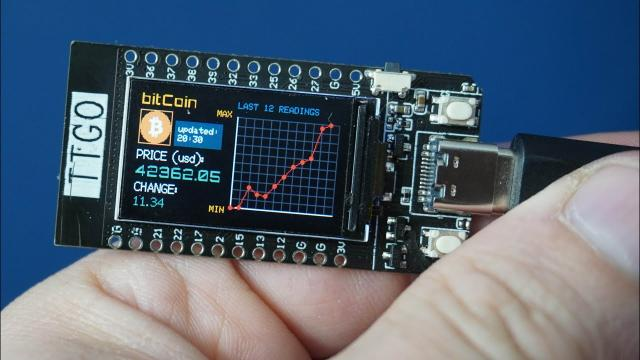

<h1>bitCoinTTGO for T-Display-S3</h1>

## Description

bitCoinTTGO [original version](https://github.com/VolosR/bitCoinTTGO) is a software developed for [T-Display board](https://www.lilygo.cc/products/lilygo%C2%AE-ttgo-t-display-1-14-inch-lcd-esp32-control-board).  

The modified version on this repository works on [T-Display-S3 board](https://www.lilygo.cc/products/t-display-s3) and has some improvements (see commits messages for details).
